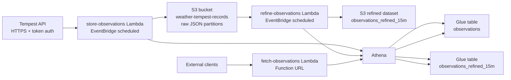
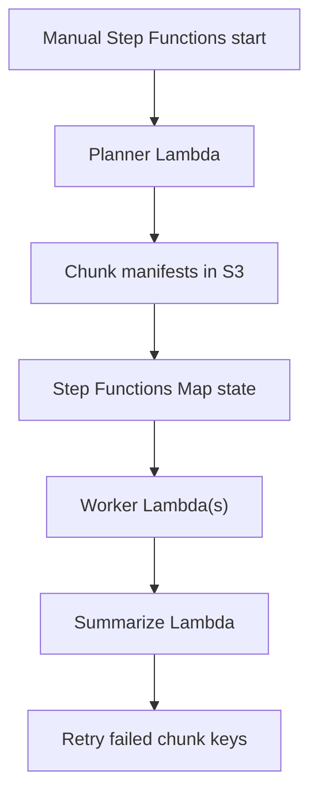
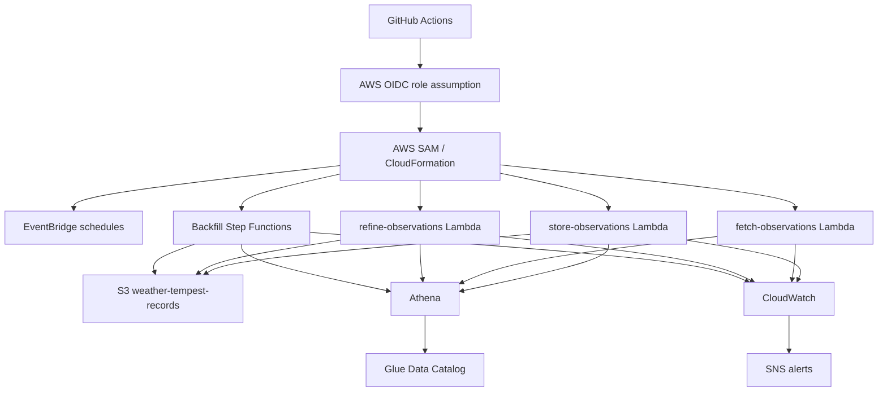

# Weather Architecture

## Overview

This repository is an npm workspace monorepo for a weather data platform built around the Tempest weather API and AWS serverless services.

At a high level, the system:

- pulls raw observations from Tempest on a schedule
- stores those observations in Amazon S3 using time-based partitions
- exposes query APIs backed by Amazon Athena
- builds a lower-cost refined dataset for longer-range analytics
- supports historical backfills with AWS Step Functions
- deploys package-by-package through GitHub Actions and AWS SAM

The main runtime target is AWS in `eu-west-2`.

## Monorepo layout

| Path | Purpose |
| --- | --- |
| `packages/store-observations` | Scheduled ingestion Lambda that fetches Tempest observations, writes raw JSON to S3, and registers Athena partitions |
| `packages/fetch-observations` | Public query Lambda exposing raw and refined observation queries over a Lambda Function URL |
| `packages/refine-observations` | Scheduled refinement Lambda that aggregates raw observations into 15-minute analytical data |
| `packages/backfill-observations` | Step Functions + Lambda workflow for historical partition and refined-data backfills |
| `packages/cloud-computing` | Shared AWS adapters and utilities used by the other packages |
| `infra/github-tempest-cfn-deploy-role` | Infrastructure for the GitHub-to-AWS deployment role/policy stack |
| `.github/workflows` | CI/CD workflows for testing, tagging, and package deployments |

## Package responsibilities

### `@weather/store-observations`

This package is the ingestion entrypoint.

- Triggered by an EventBridge schedule in `packages/store-observations/template.yaml`
- Calls the Tempest API over HTTPS from `packages/store-observations/src/utils/request.ts`
- Fetches the previous UTC day's readings in `packages/store-observations/src/services/observations-service.ts`
- Writes raw JSON objects into the `weather-tempest-records` S3 bucket
- Registers Athena partitions after ingest in `packages/store-observations/src/services/device-observations-service.ts`

The Lambda handler is `packages/store-observations/src/index.ts`.

### `@weather/fetch-observations`

This package is the read/query API.

- Exposes a public Lambda Function URL in `packages/fetch-observations/template.yaml`
- Supports `/observations` for raw data and `/refined` for 15-minute aggregates
- Validates query parameters and field selection before building Athena SQL
- Supports synchronous query execution and asynchronous query polling
- Uses a dedicated Athena workgroup with bytes-scanned guardrails

The Lambda handler is `packages/fetch-observations/src/index.ts`.

### `@weather/refine-observations`

This package builds the analytical dataset.

- Triggered daily by EventBridge in `packages/refine-observations/template.yaml`
- Uses Athena to ensure the refined table exists
- Checks whether a target day was already refined
- Aggregates raw rows into 15-minute buckets
- Writes partitioned refined data to S3 for lower-cost, broader-range analytics

The Lambda handler is `packages/refine-observations/src/index.ts`, and the core logic is in `packages/refine-observations/src/services/refinement-service.ts`.

### `@weather/backfill-observations`

This package supports bulk historical recovery and repair workflows.

- Contains planner/worker/summarize Lambdas for raw partition backfills
- Contains refine-planner/refine-worker Lambdas for refined historical backfills
- Uses two Step Functions state machines defined in `packages/backfill-observations/template.yaml`
- Chunks work for parallel execution and resumable reruns
- Writes manifests and chunk files to S3

This package is intended for operational backfill runs rather than the steady-state daily pipeline.

### `@weather/cloud-computing`

This package is the shared library for AWS access.

- `src/adapters/storage.ts` wraps Amazon S3 access
- `src/adapters/database.ts` wraps Athena query execution, polling, result retrieval, cancellation, and partition registration
- `src/utils/partition-date-parts.ts` provides shared UTC partition helpers

The other packages depend on this package for their AWS interactions.

## Runtime architecture

### Primary data flow

### Ingestion flow

The ingestion path runs once per day and is centered on `store-observations`.

1. EventBridge invokes the ingestion Lambda.
2. The Lambda calls the Tempest API over HTTPS.
3. Each observation is converted into the internal model and written to `s3://weather-tempest-records/`.
4. Object keys are partitioned by UTC time segments so Athena can prune scans efficiently.
5. The Lambda then issues Athena partition-registration queries so the raw table can see the newly written files.

The raw dataset is stored as JSON and partitioned by:

- `year`
- `month`
- `day`
- `hour`

## Data storage model

### Raw dataset

The raw dataset lives under the `weather-tempest-records` bucket and is represented in Glue/Athena as the `observations` table.

Characteristics:

- source format: JSON
- partitioning: `year/month/day/hour`
- write path: direct S3 object writes from `store-observations`
- query engine: Athena
- intended use: high-detail, shorter time-window analysis

### Refined dataset

The refined dataset is generated by `refine-observations` and stored under:

- `s3://weather-tempest-records/refined/observations_refined_15m/`

Characteristics:

- source format: parquet-oriented analytical output managed through Athena/Glue
- grain: 15-minute windows
- measures: averages, sums, max gust, and sample count
- intended use: longer date ranges with lower scan cost and better latency

The refinement logic is idempotent at the day level: it checks for existing rows for the target date before inserting new data.

## Query architecture

### Public API surface

`fetch-observations` exposes a public Lambda Function URL with `AuthType: NONE`.

Supported endpoints:

- `/observations` for raw data
- `/refined` for refined data

Supported modes:

- sync mode: starts and completes a bounded Athena query in one request
- async mode: starts a query and returns a `queryExecutionId`, then clients poll for status/results

### Query behavior

The query Lambda:

- validates `from` and `to` ranges
- restricts field selection to approved columns
- limits query windows to 7 days
- supports pagination via `nextToken`
- cancels Athena queries if Lambda is close to timeout

The package uses a dedicated Athena workgroup configured in the SAM template to enforce query guardrails, including bytes-scanned limits and a shared output location under `s3://weather-tempest-records/queries/`.

## Backfill architecture

Historical operations are handled by `backfill-observations`.

There are two backfill tracks:

- raw partition registration backfill
- refined 15-minute historical backfill

The workflows are chunk-based and orchestrated with AWS Step Functions.

Operational characteristics:

- chunk manifests are written to S3
- concurrency is controlled by a `maxConcurrency` input
- reruns can target only failed chunks
- raw partition registration uses `ADD IF NOT EXISTS`
- refined backfill skips dates that already have refined rows

## Communication protocols and boundaries

| Boundary | Protocol / mechanism | Notes |
| --- | --- | --- |
| Tempest API -> `store-observations` | HTTPS | Token-based request from Node's `https` client |
| EventBridge -> scheduled Lambdas | AWS EventBridge schedule | Daily schedules for ingestion and refinement |
| Clients -> `fetch-observations` | HTTPS over Lambda Function URL | Public function URL with no auth configured in SAM |
| Lambdas -> S3 | AWS SDK for JavaScript v3 | Raw object writes, query outputs, and backfill manifests |
| Lambdas -> Athena | AWS SDK for JavaScript v3 | Query execution, polling, cancellation, and results |
| Lambdas -> Glue | Athena/Glue permissions | Table and partition metadata management |
| Operators -> Step Functions | AWS API / CLI | Backfill workflows are started manually or operationally |
| CloudWatch -> SNS/email | AWS alarms and notifications | Optional alert email route for errors, throttles, and duration alarms |

## Remote AWS architecture

The deployed system is a small serverless AWS estate in `eu-west-2`.

Provisioned components include:

- Lambda functions and Lambda layers
- EventBridge schedules
- Lambda Function URL for the query service
- Athena workgroups
- Glue database/table resources
- Step Functions state machines
- SNS topics and subscriptions for alerting
- CloudWatch alarms

## Deployment architecture

Deployments are package-driven rather than repository-wide.

### Release flow

1. A pull request is merged to `main`.
2. `.github/workflows/tag-packages-on-merge.yml` determines which packages changed.
3. The workflow creates package-scoped tags such as `pkg/store-observations/vX.Y.Z`.
4. Tag-based deployment workflows select the right reusable deployment workflow.
5. GitHub Actions assumes an AWS role using OIDC.
6. AWS SAM builds and deploys the targeted package stack.

### Workflow patterns

- `reusable-deploy-sam-observations.yml` deploys the Lambda-based observation packages
- `reusable-deploy-sam-backfill.yml` deploys the backfill Step Functions stack
- `reusable-deploy-cloud-computing.yml` builds and publishes the shared package artifact
- `reusable-deploy-role-policy.yml` deploys the GitHub deployment-role policy stack
- `deploy-package-manual.yml` allows manual deployment of a chosen package and tag

### Remote access model

GitHub Actions uses:

- OpenID Connect to assume the AWS deploy role
- repository variables for non-secret deployment parameters
- repository secrets for values such as `TEMPEST_TOKEN`

The deploy-role infrastructure lives under `infra/github-tempest-cfn-deploy-role`.

## Operational characteristics

### Idempotency

- Athena partition registration uses `ADD IF NOT EXISTS`
- refined daily processing skips dates that have already been processed
- failed backfill chunks can be rerun without rerunning the entire workflow

### Guardrails

- query windows are capped in the public API
- Athena queries use polling limits and cancellation
- the query API uses a dedicated workgroup instead of the default shared runtime path
- artifact buckets used in deployment get lifecycle policies from CI

### Observability

Each deployed package template includes CloudWatch alarms for key failure modes:

- Lambda errors
- Lambda throttles
- long-running invocations close to timeout
- Step Functions execution failures and timeouts for backfill flows

Optional notifications are wired through an SNS topic with an email subscription when `AlertEmail` is configured.

### Runtime assumptions

- Node.js 24.x Lambda runtime
- AWS SAM for packaging and deployment
- S3-backed Athena query results
- UTC-based partitioning and scheduling

## Architecture trade-offs

This design favors simple, low-operations serverless components:

- S3 + Athena avoids running a persistent database for time-series reads
- raw and refined datasets support both detailed and cost-efficient analytical access
- package-level deployment keeps infrastructure changes scoped
- Step Functions keeps backfills explicit and operationally controllable

The main trade-off is that Athena-backed APIs are not low-latency OLTP services, so the query package uses bounded windows, async polling, and a refined dataset to keep read performance predictable.

## Source files for this document

This document was derived from the current repository implementation, especially:

- `package.json`
- `README.md`
- `packages/*/src/index.ts`
- `packages/store-observations/src/services/*.ts`
- `packages/fetch-observations/src/index.ts`
- `packages/refine-observations/src/services/refinement-service.ts`
- `packages/cloud-computing/src/adapters/*.ts`
- `packages/*/template.yaml`
- `packages/backfill-observations/README.md`
- `.github/workflows/*.yml`
- `infra/github-tempest-cfn-deploy-role/template.yaml`
