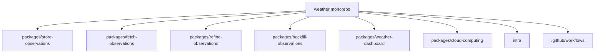
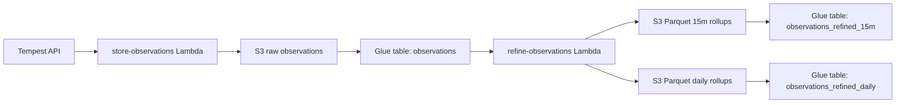
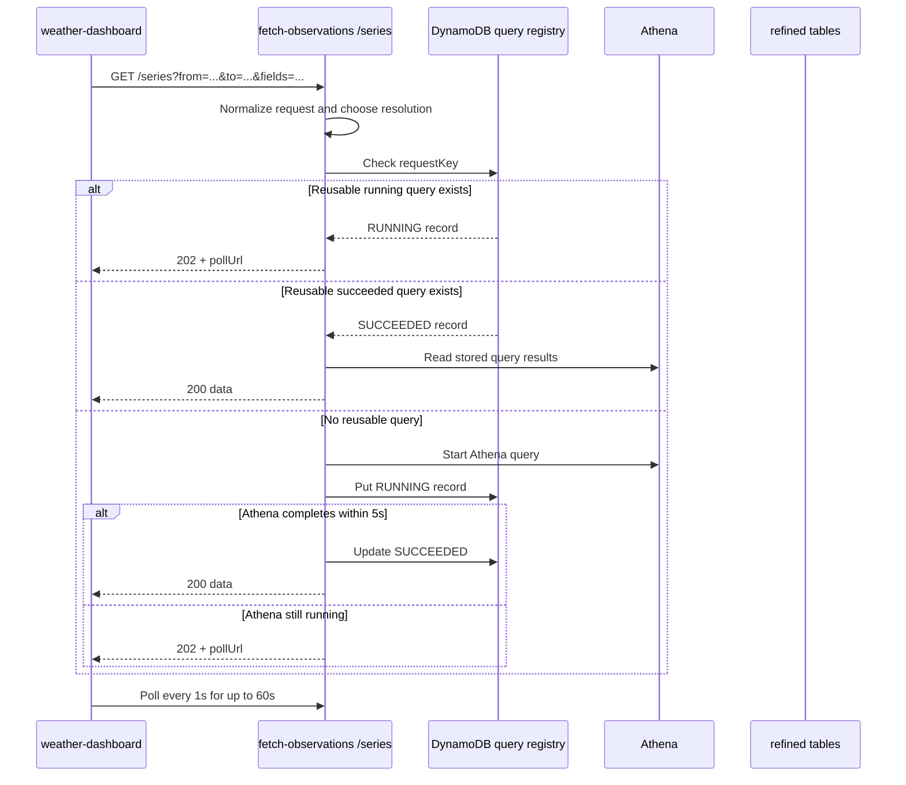
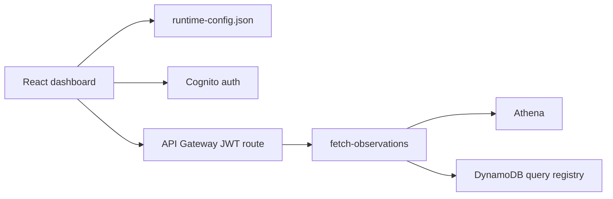

# Architecture

This document describes the repository structure and the runtime architecture of the weather application.

## Repository structure

## Package responsibilities

- `store-observations`
  Pulls Tempest observations and writes raw partitioned JSON into S3.
- `fetch-observations`
  Exposes Athena-backed query endpoints, including the dashboard-oriented `/series` endpoint.
- `refine-observations`
  Builds coarser Parquet rollups for long-range analytics.
- `backfill-observations`
  Rebuilds missing historical partitions.
- `weather-dashboard`
  Private authenticated web app for weather trends.
- `cloud-computing`
  Shared AWS adapters and utilities.
- `infra`
  Shared infrastructure stacks, including GitHub deploy-role policies.
- `.github/workflows`
  Tag-driven and manual deployment pipelines.

## Data flow

## Query architecture

The system now supports both high-detail inspection and long-range trend analysis without changing the dashboard request shape.

### Query paths

- `/observations`
  Raw Athena queries over the `observations` table.
- `/refined`
  Direct Athena queries over `observations_refined_15m`.
- `/series`
  Trend-oriented endpoint that chooses the most appropriate resolution automatically.

### Resolution selection

`/series` currently routes requests like this:

- up to `7d` -> `15m`
- over `7d` up to `18 months` -> `daily`
- over `18 months` -> `monthly`

`monthly` results are derived at query time from `observations_refined_daily`.

## Long-range query flow

## Why the query registry exists

Long-range Athena queries can outlive a single HTTP request. The query registry exists so the same user can:

- refresh the page
- resubmit the same range query
- resume polling a still-running query

without starting duplicate Athena executions.

The registry is stored in DynamoDB because it needs:

- atomic conditional create
- consistent point reads
- cheap TTL-based cleanup

## Dashboard architecture

The dashboard remains thin. It:

- authenticates through Cognito
- requests chart data from `/series`
- displays loading, pending, success, and failure states
- shows the returned `aggregationLevel` so users can see the current level of detail

## Deployment architecture

- Packages are deployed independently with package-scoped tags.
- Shared deploy permissions are managed through the `github-tempest-cfn-deploy-role` infrastructure stack.
- The dashboard deploy depends on the role-policy stack being up to date before application deployment starts.

## Design constraints

- Keep cost low by preferring Athena plus pre-aggregated Parquet over always-on databases.
- Keep handlers thin and business logic in `services`.
- Preserve idempotency in scheduled data-processing jobs.
- Prefer package-local documentation for package behavior and this document for cross-package architecture.
