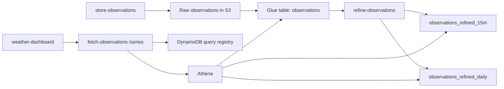

# Weather

A weather application that queries the tempest wx weather API.

Architecture reference:

- [ARCHITECTURE.md](/Users/samyounger/development/weather/ARCHITECTURE.md)

## Installation instructions

```sh
$ npm install
```

## Start the application

```sh
$ npm run start
```

## Deployments

Deployments are tag-driven.

### How it works
1. A PR is merged to `main`.
2. `.github/workflows/tag-packages-on-merge.yml` checks changed files and dependency impact per package.
3. For each affected package, the workflow creates a package-scoped semver tag:
   - `pkg/store-observations/vX.Y.Z`
   - `pkg/fetch-observations/vX.Y.Z`
   - `pkg/refine-observations/vX.Y.Z`
   - `pkg/backfill-observations/vX.Y.Z`
   - `pkg/weather-dashboard/vX.Y.Z`
   - `pkg/cloud-computing/vX.Y.Z`
   - `pkg/github-tempest-cfn-deploy-role/vX.Y.Z` (IAM deploy-role policy stack)
4. Tag push triggers `.github/workflows/deploy-from-package-tag.yml`.
5. The tag deploy workflow:
   - creates a GitHub Deployment record per environment
   - runs the package deployment via reusable workflows
   - updates deployment status to `success` or `failure`
   - writes a run summary to `$GITHUB_STEP_SUMMARY`

### Reusable deployment workflows
- `.github/workflows/reusable-deploy-sam-observations.yml`
- `.github/workflows/reusable-deploy-sam-backfill.yml`
- `.github/workflows/reusable-deploy-cloud-computing.yml`
- `.github/workflows/reusable-deploy-weather-dashboard.yml`
- `.github/workflows/reusable-deploy-role-policy.yml`

### Required GitHub repository variables
- `AWS_IAM_DEPLOY_ROLE_ARN`
- `AWS_IAM_BOOTSTRAP_DEPLOY_ROLE_ARN`
- `ALERT_EMAIL`
- `TEMPEST_HOST`
- `TEMPEST_DEVICE_ID`
- `TEMPEST_STATION_ID`

### Required GitHub repository secrets
- `TEMPEST_TOKEN`

### Local/manual AWS SAM deploy (optional)
Deployments in CI are tag-driven, but local deploy is still available.

`$ npm run deploy --workspace=@weather/store-observations`
`$ npm run deploy --workspace=@weather/fetch-observations`
`$ npm run deploy --workspace=@weather/refine-observations`
`$ npm run deploy --workspace=@weather/backfill-observations`
`$ npm run deploy --workspace=@weather/weather-dashboard`

Infrastructure settings such as stack name, region, and artifact bucket are defined in each package's `samconfig.toml`.

## Query architecture

The repository supports both short-range inspection and long-range trend analysis without changing the frontend contract.



### Resolution strategy

`fetch-observations` now routes dashboard trend requests automatically:

- short windows -> `observations_refined_15m`
- medium and long windows -> `observations_refined_daily`
- very long views -> monthly aggregation over daily rollups

This keeps Athena scan sizes low while still returning usable multi-year trend lines.

### Async long-range query behavior

The `/series` endpoint waits up to 5 seconds for Athena to finish.

If Athena does not complete in that window:

- the API returns `202`
- the frontend polls every second
- polling stops after one minute
- the response includes a resumable poll URL

### In-flight query reuse

The same user can refresh and resubmit the same trend query without starting a duplicate Athena execution.

This works through a DynamoDB-backed query registry keyed by a normalized `requestKey`.

The registry stores:

- `requestKey`
- `queryExecutionId`
- `status`
- `aggregationLevel`
- `tableName`
- `expiresAt`

Because the registry uses conditional writes, duplicate long-range requests now attach to the same in-flight query instead of racing each other.

## Refine observations logic

`refine-observations` is the scheduled Lambda that creates the lower-granularity Parquet datasets used by long-range queries.

### What it does

1. Runs daily in UTC.
2. Targets the previous UTC day.
3. Ensures refined Glue tables exist.
4. Skips partitions that were already refined.
5. Writes:
   - `observations_refined_15m`
   - `observations_refined_daily`

### Why this matters

- raw observations are too expensive for long-range trend reads
- daily rollups make year-scale queries practical
- monthly views can be derived cheaply from daily data without another always-on service

## Environment variables

The following environment variables are required for the source code, as provided in a .env file at root of the project. The application uses the [dotenv](https://github.com/motdotla/dotenv) module to make these variables available in the source code, example `process.env.NODE_ENV`.

```sh
TEMPEST_HOST="swd.weatherflow.com"
TEMPEST_TOKEN="some-token"
TEMPEST_DEVICE_ID="123"
TEMPEST_STATION_ID="321"
```

Infrastructure settings such as stack name, region, and artifact bucket are defined in each package's `samconfig.toml`.
