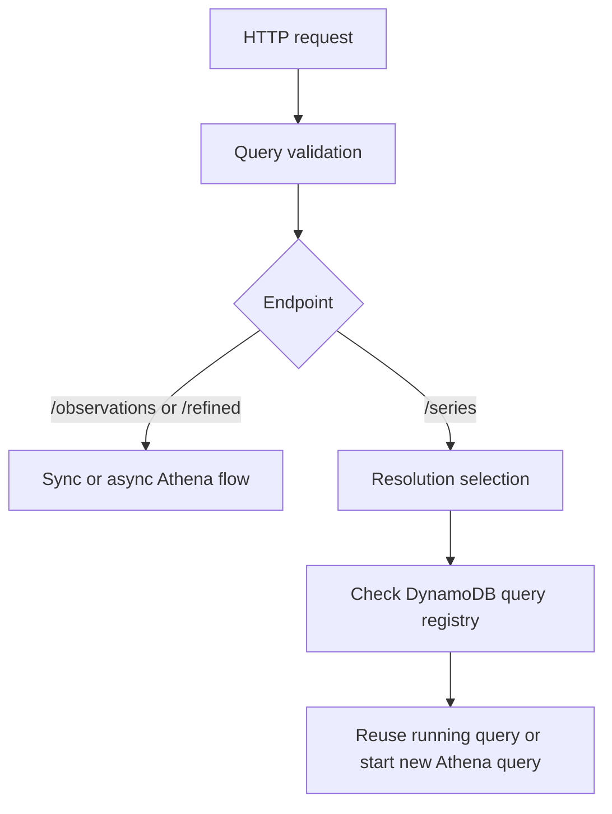

# fetch-observations Agent Draft

## Purpose

API Lambda package that fetches weather observations by querying Athena over partitioned datasets in S3.

## Runtime Behavior

- Entrypoint: `src/index.ts`
- Validates query string parameters.
- Builds SQL query fragments based on requested filters and fields.
- Executes Athena queries through shared cloud-computing adapters.
- Exposes `/observations`, `/refined`, and `/series`.
- `/series` automatically chooses `15m`, `daily`, or `monthly` detail based on the requested range.
- `/series` uses a DynamoDB-backed query registry to reuse in-flight long-range Athena queries.

## Request Flow

## Infrastructure

- SAM template: `template.yaml`
- Stack/env config: `samconfig.toml`
- Deployed as a Lambda workload for read/query access patterns.
- Requires a DynamoDB query-registry table in the same SAM stack.

## Commands

- `npm run build --workspace=@weather/fetch-observations`
- `npm run test --workspace=@weather/fetch-observations`
- `npm run test:coverage --workspace=@weather/fetch-observations`
- `npm run deploy --workspace=@weather/fetch-observations`

## Notes for Changes

- Query parameter validation and SQL generation should stay tightly tested.
- Any schema changes in raw/refined tables should be reflected in query builders and tests.
- Changes to `/series` should preserve request deduplication and polling semantics.
