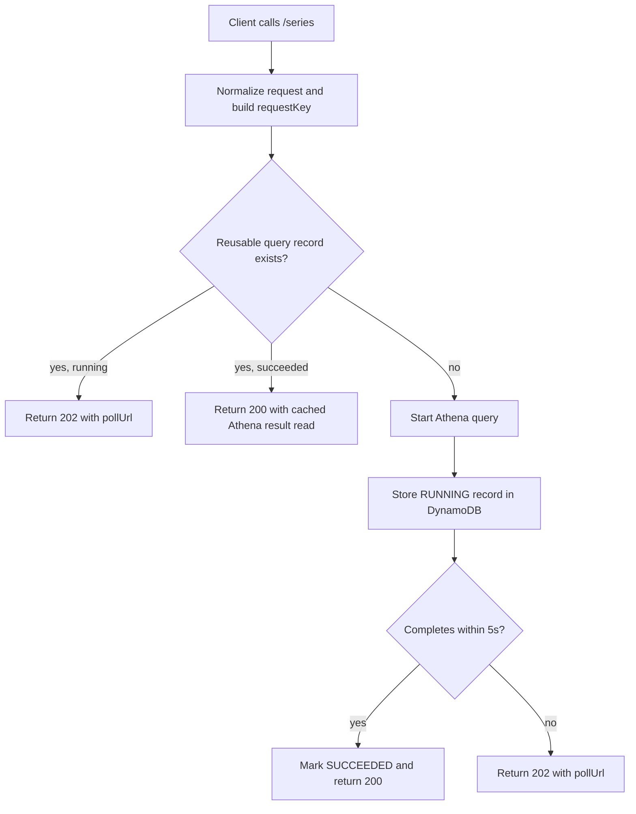

# Fetch Observations Package

Athena-backed API Lambda for raw queries, refined queries, and long-range chart series queries.

## Endpoints

- `/observations` or `/` queries the raw `observations` table.
- `/refined` queries the `observations_refined_15m` table directly.
- `/series` is the dashboard-focused trend endpoint with automatic resolution selection and async fallback.

## Query Modes

### Sync mode

Supported on `/observations`, `/refined`, and `/series`.

Required query params:

- `from`
- `to`

Optional query params:

- `fields`
- `limit`
- `nextToken`

### Async mode

Supported on:

- `/observations`
- `/refined`
- `/series`

For `/observations` and `/refined`, async mode is keyed by `queryExecutionId`.

For `/series`, async mode is keyed by `requestKey`, which is stable for the same user plus normalized request shape.

## `/series` Endpoint

`/series` is the dashboard-facing trend endpoint. It adds:

- automatic resolution selection
- longer date ranges including custom ranges
- 5-second synchronous wait budget
- async polling after timeout
- request deduplication for identical in-flight queries

### Resolution selection

The backend chooses the cheapest dataset that still returns a useful trend:

- up to `7d` -> `15m`
- over `7d` up to `18 months` -> `daily`
- over `18 months` -> `monthly`

`monthly` is produced by aggregating from `observations_refined_daily` at query time.

### Series request flow



### Query registry

`/series` uses a DynamoDB-backed query registry to track in-flight and completed requests.

Each record stores:

- `requestKey`
- `queryExecutionId`
- `status`
- `aggregationLevel`
- `tableName`
- `queryString`
- timestamps and `expiresAt`

This prevents duplicate Athena executions when the same user refreshes the page and resubmits the same trend query.

### Why DynamoDB

The registry used to be S3-backed, which left a read-then-write race window.

DynamoDB now provides:

- atomic conditional create for in-flight deduplication
- consistent reads for polling state
- TTL cleanup via `expiresAt`

## `/series` Async Polling Contract

Initial request:

```bash
curl "https://<function-url>/series?from=2025-01-01T00:00:00Z&to=2026-01-01T00:00:00Z&fields=period_start,airtemperature_avg,relativehumidity_avg&limit=1000"
```

If the query exceeds the 5-second wait budget, the API returns `202`:

```json
{
  "status": "PENDING",
  "requestKey": "abc123",
  "queryExecutionId": "athena-query-id",
  "aggregationLevel": "daily",
  "pollAfterMs": 1000,
  "pollUrl": "https://.../series?mode=async&requestKey=abc123"
}
```

Poll request:

```bash
curl "https://<function-url>/series?mode=async&requestKey=abc123"
```

Poll responses:

- `202` while still running
- `200` when ready
- `500` when Athena failed or was cancelled
- `404` when the registry record has expired or does not exist

## Field Selection

`fields` must be a comma-separated subset of allowed columns for the endpoint being called.

### Raw endpoint fields

- `deviceid`
- `datetime`
- `windlull`
- `windavg`
- `windgust`
- `winddirection`
- `windsampleinterval`
- `pressure`
- `airtemperature`
- `relativehumidity`
- `illuminance`
- `uv`
- `solarradiation`
- `rainaccumulation`
- `precipitationtype`
- `avgstrikedistance`
- `strikecount`
- `battery`
- `reportinterval`
- `localdayrainaccumulation`
- `ncrainaccumulation`
- `localdayncrainaccumulation`
- `precipitationanalysis`
- `year`
- `month`
- `day`
- `hour`

### Refined and series fields

- `period_start`
- `winddirection_avg`
- `windavg_avg`
- `windgust_max`
- `pressure_avg`
- `airtemperature_avg`
- `relativehumidity_avg`
- `rainaccumulation_sum`
- `uv_avg`
- `solarradiation_avg`
- `sample_count`
- `year`
- `month`
- `day`
- `hour`

## Validation and limits

- `from` and `to` must be valid ISO-8601 date-time strings
- `from` must be earlier than `to`
- `limit` must be a positive integer
- maximum `limit` is `1000`
- `/observations` and `/refined` keep tighter bounded-window validation
- `/series` allows longer windows and chooses aggregation automatically

## Safety controls

- Athena runs in a dedicated workgroup
- synchronous query preparation still uses the Lambda timeout safety buffer
- `/series` only waits up to 5 seconds before switching to async behavior
- query-registry entries expire automatically via DynamoDB TTL

## Commands

```sh
npm run build --workspace=@weather/fetch-observations
npm run test --workspace=@weather/fetch-observations
npm run test:coverage --workspace=@weather/fetch-observations
npm run deploy --workspace=@weather/fetch-observations
```
