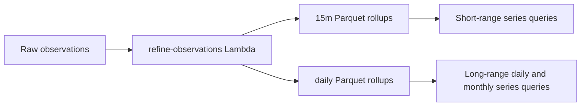

# refine-observations Agent Draft

## Purpose

Scheduled Lambda that refines raw high-frequency observations into a lower-granularity Athena dataset for analytics.

## Runtime Behavior

- Entrypoint: `src/index.ts`
- Runs on a schedule (via EventBridge).
- Targets the previous UTC day.
- Ensures refined table availability and performs idempotent checks before processing.
- Aggregates raw observations into coarser-grained output.
- Produces both `observations_refined_15m` and `observations_refined_daily`.

## Data Flow

## Infrastructure

- SAM template: `template.yaml`
- Stack/env config: `samconfig.toml`

## Commands

- `npm run build --workspace=@weather/refine-observations`
- `npm run test --workspace=@weather/refine-observations`
- `npm run test:coverage --workspace=@weather/refine-observations`
- `npm run deploy --workspace=@weather/refine-observations`

## Notes for Changes

- Preserve idempotency for daily runs.
- Validate query logic and table/partition assumptions with tests when changing refinement SQL.
- Keep rollup shape aligned with the fields expected by `fetch-observations /series`.
