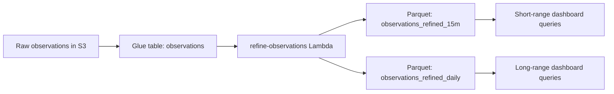

# Refine Observations Package

Scheduled Lambda that builds lower-granularity Athena datasets from raw Tempest observations.

## What it produces

- `observations_refined_15m`
- `observations_refined_daily`

These rollups are stored as Parquet in S3 and queried by `fetch-observations` for longer-range dashboard views.

## Why it exists

The raw `observations` table is good for short, high-detail windows, but it becomes slower and more expensive for trend queries across months or years. This package keeps long-range reads cheap by pre-aggregating the data into coarser tables.

## Rollup strategy

- `15m` rollup is used for short-range charts where detail still matters.
- `daily` rollup is used for longer trend windows where per-observation detail is unnecessary.
- `monthly` chart views are derived at query time from the daily rollup rather than materialized as a separate table today.

## Processing flow



## Daily behavior

1. Runs on a schedule and targets the previous UTC day.
2. Ensures the rollup tables exist.
3. Checks whether the target partition has already been written.
4. Skips work when the day is already refined.
5. Writes fresh aggregates when the partition is missing.

The job is intentionally idempotent so retries do not duplicate partitions.

## Aggregated metrics

- averages for metrics such as temperature, humidity, pressure, UV, solar radiation, and mean wind
- `max` for wind gust
- `sum` for rainfall
- `sample_count` for data-density visibility

## Commands

```sh
npm run build --workspace=@weather/refine-observations
npm run test --workspace=@weather/refine-observations
npm run test:coverage --workspace=@weather/refine-observations
npm run deploy --workspace=@weather/refine-observations
```

## Relationship to query routing

`fetch-observations` automatically routes range queries to the cheapest table that still matches the requested trend detail:

- short range -> `observations_refined_15m`
- medium and long range -> `observations_refined_daily`
- very long monthly trend views -> monthly aggregation over `observations_refined_daily`
