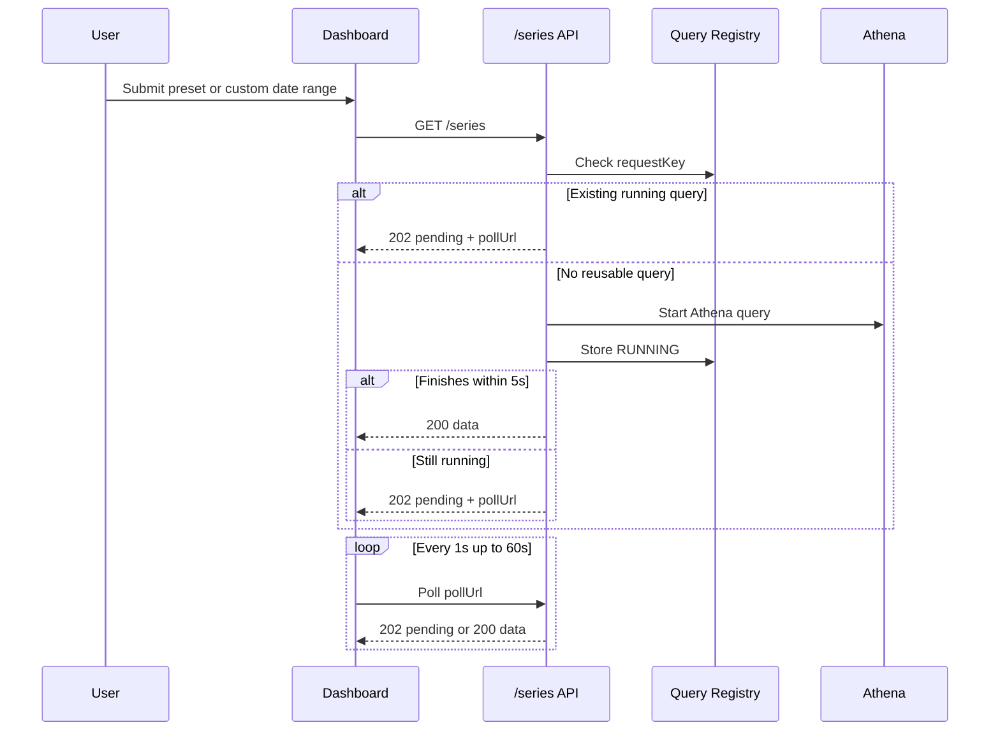

# Weather Dashboard Package

Private PWA dashboard for authenticated weather trends.

## Architecture

- React + TypeScript + Vite
- Cognito password auth
- API Gateway HTTP API with JWT authorizer
- S3 + CloudFront static hosting
- runtime-config driven deployment values

## Runtime config

The deployed app reads `/runtime-config.json` at runtime.

Required keys:

- `apiBaseUrl`
- `cognitoRegion`
- `cognitoUserPoolId`
- `cognitoClientId`

Optional keys:

- `mockMode`

## Trend Query Behavior

The dashboard now uses the `/series` API endpoint for chart data. That endpoint supports:

- short-range detail
- multi-year trend queries
- custom date ranges
- automatic resolution selection
- async polling when Athena does not finish within 5 seconds

### Presets

- `24h`
- `72h`
- `7d`
- `30d`
- `90d`
- `1y`
- `3y`
- `5y`
- `custom`

### Resolution behavior

The frontend does not choose the storage table directly.

It sends the requested date window and lets the backend decide whether to use:

- `15m`
- `daily`
- `monthly`

The returned `aggregationLevel` is shown in the UI so the user can see whether the chart is detailed or long-range.

## Loading and async UX

The chart view has three distinct states:

- immediate loading overlay while a query is dispatched
- pending async polling when the backend returns `202`
- error state with a resumable poll link when the query fails or remains incomplete

### Client flow



## Local mock mode

`public/runtime-config.json` is configured for local mock mode in this repo so:

```sh
npm run start:dev --workspace=@weather/weather-dashboard
```

This runs without AWS, Cognito, or the live API.

When `mockMode` is `true`:

- any email/password can sign in locally
- sign-up and confirmation stay in-app without Cognito
- chart requests return deterministic sample weather data
- the mock loader includes a short artificial delay so loading states are visible during UI work

## Chart UX

The dashboard now includes:

- loading overlay while chart data is fetched
- Y-axis label derived from the selected metric
- summary table under the chart with `High`, `Low`, and `Average`
- responsive layout for smaller screens

## Commands

```sh
npm run build --workspace=@weather/weather-dashboard
npm run test --workspace=@weather/weather-dashboard
npm run test:coverage --workspace=@weather/weather-dashboard
npm run deploy --workspace=@weather/weather-dashboard
```
